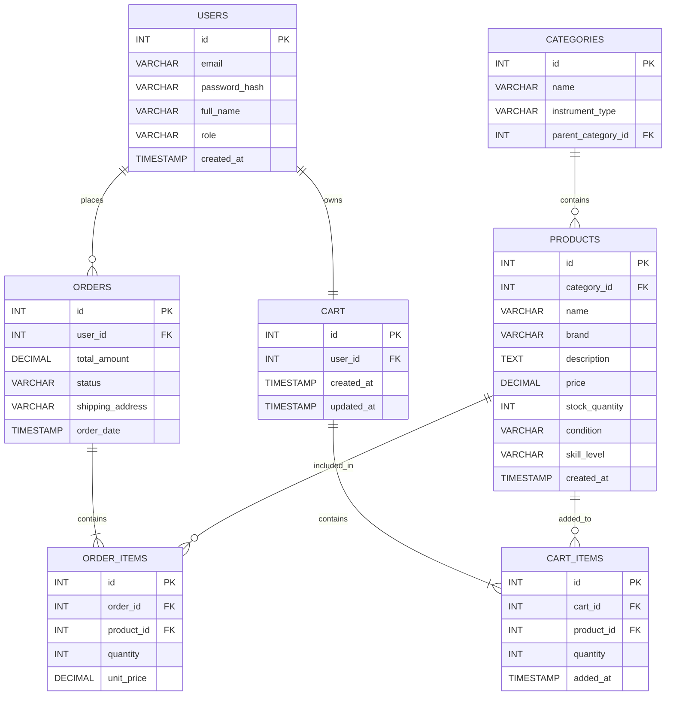

# Sprint 1: System Architecture & Scope Definition

## Project: HarmonyHub — Musical Instruments E-Commerce Platform

---

## Section 1: Target Audience & Market Focus

### Primary Persona

HarmonyHub is mainly designed for music students, musicians, and people who enjoy playing musical instruments. Parents can also use the website when they want to buy an instrument for their children.

Users can find different musical instruments and accessories in one place. They can browse the products, check their prices and details, and choose an instrument according to their needs.

### Core Pain Point

Buying the right musical instrument online can be difficult because there are many different types, brands, and price ranges. This can be more confusing for beginners who may not know which instrument is suitable for them.

The website will make the shopping process easier by allowing users to search for instruments, view product information, compare different options, and place orders online. Details such as price, stock, description, and skill level will help users decide before buying a product.

### Domain Scope

The project is based on the Musical Instruments and Accessories E-Commerce domain.

The website will include different musical instruments and their accessories, such as:

* Guitars, bass guitars, violins, and ukuleles
* Drums and other percussion instruments
* Keyboards and digital pianos
* Wind and brass instruments
* Accessories such as strings, tuners, cases, and pedals

The main focus of the project will be product browsing, searching, shopping cart management, and placing orders online.

---

## Section 2: MVP Feature Scope

MVP stands for Minimum Viable Product. In this project, it means the basic features required to make the online musical instrument store usable.

The following features will be included in the MVP:

| Category       | Feature Name              | Description                                                                                               | Priority   |
| -------------- | ------------------------- | --------------------------------------------------------------------------------------------------------- | ---------- |
| Authentication | User Registration & Login | Users can create an account and log in to the website.                                                    | High (MVP) |
| Catalog        | Product List & Search     | Users can browse instruments and search for products by name, type, brand, price, or skill level.         | High (MVP) |
| Catalog        | Product Details           | Users can open a product to see its name, price, images, description, available stock, and other details. | High (MVP) |
| Cart           | Cart Management           | Users can add products to their cart, change quantities, or remove products.                              | High (MVP) |
| Checkout       | Order Processing          | Users can review their cart and place an order using a mock payment process.                              | High (MVP) |
| Admin          | Inventory Control         | The admin can add, update, and delete products and manage stock and categories.                           | Medium     |

### MVP Scope

The main purpose of the MVP is to provide the basic shopping functions of an online musical instrument store.

A user should be able to register, log in, browse products, view product details, add products to the cart, and place an order.

The admin will manage products, categories, and stock. Features such as advanced product recommendations and live delivery tracking will not be included in the main MVP because they are not required for the basic shopping process.

---

## Section 3: Tech Stack Selection & Justification

### Frontend Framework

**React.js with Vite**

React.js will be used to create the frontend of the website. It will be used for pages such as the home page, product listing, product details, shopping cart, and login page.

React.js was selected because it allows reusable components to be created and makes it easier to build interactive pages. Vite will be used to set up the React project and make development faster.

### Backend Infrastructure

**Node.js with Express.js**

Node.js and Express.js will be used for the backend of the project. The backend will handle user login, product data, cart operations, and order processing.

These technologies are suitable for creating REST APIs and can work well with React.js. Using JavaScript for both the frontend and backend also makes the overall development easier.

### Database Management System

**PostgreSQL**

PostgreSQL will be used to store the data of the e-commerce website. It will contain information about users, products, categories, carts, and orders.

PostgreSQL is suitable for this project because there are several tables that are connected with each other. It will help keep the data organized and maintain relationships between things such as products, users, and orders.

### Authentication

**JWT (JSON Web Token)**

JWT will be used for user authentication. It will help the system identify users after they log in and control access to protected parts of the website.

For example, only logged-in users will be able to place orders, while admin features will only be available to users with an admin role.

---

## Section 4: Entity-Relationship Diagram (ERD)

An ERD is used to show the main tables in a database and how they are connected.

For the HarmonyHub e-commerce system, the following tables will be used:

* USERS
* PRODUCTS
* CATEGORIES
* CART
* CART_ITEMS
* ORDERS
* ORDER_ITEMS

### Database Structure

The database is designed around users, products, shopping carts, and orders.

A user's account is connected to their shopping cart and orders. Products are organized through categories, while separate item tables are used for the products inside carts and orders.

The `CART_ITEMS` table connects products with carts, and `ORDER_ITEMS` connects products with orders. This makes it possible to store multiple products in a cart or order without repeating the complete product information.

### ERD

### Entity Description

**USERS:**
This table stores information about customers and admins, including their email, password, name, and role.

**CATEGORIES:**
This table stores the different categories of musical instruments. Examples include guitars, drums, and keyboards.

**PRODUCTS:**
This table stores the details of each product, including its name, brand, price, description, available stock, condition, and skill level.

**CART:**
This table stores the shopping cart of each user.

**CART_ITEMS:**
This table stores the products added to a cart along with the quantity of each product.

**ORDERS:**
This table stores the orders placed by customers. It includes information such as the total amount, order status, shipping address, and order date.

**ORDER_ITEMS:**
This table stores the individual products included in an order, along with their quantity and price.

### Relationship & Cardinality Summary

| Relationship           | Cardinality | Explanation                             |
| ---------------------- | ----------- | --------------------------------------- |
| USERS → ORDERS         | 1:N         | One user can place many orders.         |
| USERS → CART           | 1:1         | One user can have one shopping cart.    |
| CATEGORIES → PRODUCTS  | 1:N         | One category can contain many products. |
| ORDERS → ORDER_ITEMS   | 1:N         | One order can contain many order items. |
| PRODUCTS → ORDER_ITEMS | 1:N         | One product can appear in many orders.  |
| CART → CART_ITEMS      | 1:N         | One cart can contain many cart items.   |
| PRODUCTS → CART_ITEMS  | 1:N         | One product can be added to many carts. |

### Key Design Notes

* Each table has a Primary Key (PK) to identify its records.
* Foreign Keys (FK) are used to connect related tables.
* `ORDER_ITEMS` connects orders with products.
* `CART_ITEMS` connects carts with products.
* The `unit_price` in `ORDER_ITEMS` stores the product price at the time the order was placed.
* The `category_id` in `PRODUCTS` connects each product to its category.
