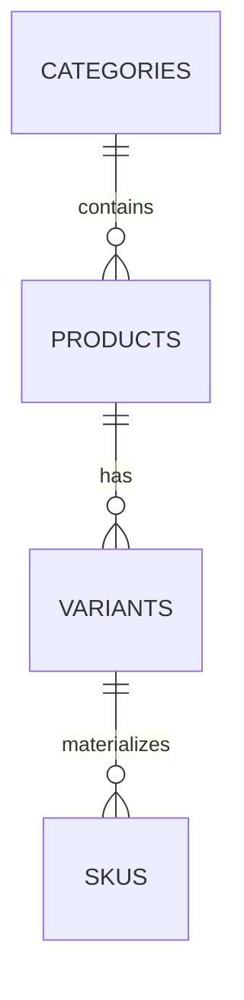

# Sprint 2 Data Foundation Report: HarmonyHub

## 1. Goal and Boundary Scope
This implementation sprint establishes a robust, highly normalized relational structure in PostgreSQL separating core Products from variable SKUs, protecting catalog transactions against floating-point data errors.

## 2. Relational Mermaid Database Schema (ERD)


## 3. Mandatory Business Rule Evaluation
* **Can a draft product have no SKU?** Yes. Metadata design stages can process items prior to physical stock logging.
* **Negative Stock Prevention:** Handled natively inside database columns using functional constraint rules (`CHECK (stock_quantity >= 0)`).

## 4. Test Verification Routine
Execute automated behavioral checks using the project package wrapper scripts:
```bash
npm run test
```